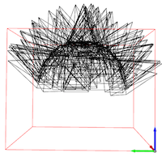
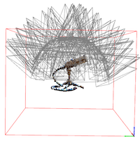

# DirectVoxGO

Direct Voxel Grid Optimization (CVPR2022 Oral, [project page](https://sunset1995.github.io/dvgo/), [DVGO paper](https://arxiv.org/abs/2111.11215), [DVGO v2 paper](https://arxiv.org/abs/2206.05085)).

https://user-images.githubusercontent.com/2712505/153380311-19d6c3a1-9130-489a-af16-ad36c78f10a9.mp4

https://user-images.githubusercontent.com/2712505/153380197-991d1689-6418-499c-a192-d757f9a64b64.mp4

### Custom casual capturing
A [short guide](https://sunset1995.github.io/dvgo/tutor_forward_facing.html) to capture custom forward-facing scenes and rendering fly-through videos.

Below are two rgb and depth fly-through videos from custom captured scenes.

https://user-images.githubusercontent.com/2712505/174267754-619d4f81-dd04-4c50-ba7f-434774cb890e.mp4

### Features
- Speedup NeRF by replacing the MLP with the voxel grid.
- Simple scene representation:
    - *Volume densities*: dense voxel grid (3D).
    - *View-dependent colors*: dense feature grid (4D) + shallow MLP.
- Pytorch cuda extention built just-in-time for another 2--3x speedup.
- O(N) realization for the distortion loss proposed by [mip-nerf 360](https://jonbarron.info/mipnerf360/).
    - The loss improves our training time and quality.
    - We have released a self-contained pytorch package: [torch_efficient_distloss](https://github.com/sunset1995/torch_efficient_distloss).
    - Consider a batch of 8192 rays X 256 points.
        - GPU memory consumption: 6192MB => 96MB.
        - Run times for 100 iters: 20 sec => 0.2sec.
- Supported datasets:
    - *Bounded inward-facing*: [NeRF](https://drive.google.com/drive/folders/128yBriW1IG_3NJ5Rp7APSTZsJqdJdfc1), [NSVF](https://dl.fbaipublicfiles.com/nsvf/dataset/Synthetic_NSVF.zip), [BlendedMVS](https://dl.fbaipublicfiles.com/nsvf/dataset/BlendedMVS.zip), [T&T (masked)](https://dl.fbaipublicfiles.com/nsvf/dataset/TanksAndTemple.zip), [DeepVoxels](https://drive.google.com/open?id=1ScsRlnzy9Bd_n-xw83SP-0t548v63mPH).
    - *Unbounded inward-facing*: [T&T](https://drive.google.com/file/d/11KRfN91W1AxAW6lOFs4EeYDbeoQZCi87/view?usp=sharing), [LF](https://drive.google.com/file/d/1gsjDjkbTh4GAR9fFqlIDZ__qR9NYTURQ/view?usp=sharing), [mip-NeRF360](https://jonbarron.info/mipnerf360/).
    - *Foward-facing*: [LLFF](https://drive.google.com/drive/folders/14boI-o5hGO9srnWaaogTU5_ji7wkX2S7).


### Installation
```
git clone git@github.com:sunset1995/DirectVoxGO.git
cd DirectVoxGO
pip install -r requirements.txt
```
[Pytorch](https://pytorch.org/) and [torch_scatter](https://github.com/rusty1s/pytorch_scatter) installation is machine dependent, please install the correct version for your machine.

<details>
  <summary> Dependencies (click to expand) </summary>

  - `PyTorch`, `numpy`, `torch_scatter`: main computation.
  - `scipy`, `lpips`: SSIM and LPIPS evaluation.
  - `tqdm`: progress bar.
  - `mmcv`: config system.
  - `opencv-python`: image processing.
  - `imageio`, `imageio-ffmpeg`: images and videos I/O.
  - `Ninja`: to build the newly implemented torch extention just-in-time.
  - `einops`: torch tensor shaping with pretty api.
  - `torch_efficient_distloss`: O(N) realization for the distortion loss.
</details>


## Directory structure for the datasets

<details>
  <summary> (click to expand;) </summary>

    data
    ├── nerf_synthetic     # Link: https://drive.google.com/drive/folders/128yBriW1IG_3NJ5Rp7APSTZsJqdJdfc1
    │   └── [chair|drums|ficus|hotdog|lego|materials|mic|ship]
    │       ├── [train|val|test]
    │       │   └── r_*.png
    │       └── transforms_[train|val|test].json
    │
    ├── Synthetic_NSVF     # Link: https://dl.fbaipublicfiles.com/nsvf/dataset/Synthetic_NSVF.zip
    │   └── [Bike|Lifestyle|Palace|Robot|Spaceship|Steamtrain|Toad|Wineholder]
    │       ├── intrinsics.txt
    │       ├── rgb
    │       │   └── [0_train|1_val|2_test]_*.png
    │       └── pose
    │           └── [0_train|1_val|2_test]_*.txt
    │
    ├── BlendedMVS         # Link: https://dl.fbaipublicfiles.com/nsvf/dataset/BlendedMVS.zip
    │   └── [Character|Fountain|Jade|Statues]
    │       ├── intrinsics.txt
    │       ├── rgb
    │       │   └── [0|1|2]_*.png
    │       └── pose
    │           └── [0|1|2]_*.txt
    │
    ├── TanksAndTemple     # Link: https://dl.fbaipublicfiles.com/nsvf/dataset/TanksAndTemple.zip
    │   └── [Barn|Caterpillar|Family|Ignatius|Truck]
    │       ├── intrinsics.txt
    │       ├── rgb
    │       │   └── [0|1|2]_*.png
    │       └── pose
    │           └── [0|1|2]_*.txt
    │
    ├── deepvoxels         # Link: https://drive.google.com/drive/folders/1ScsRlnzy9Bd_n-xw83SP-0t548v63mPH
    │   └── [train|validation|test]
    │       └── [armchair|cube|greek|vase]
    │           ├── intrinsics.txt
    │           ├── rgb/*.png
    │           └── pose/*.txt
    │
    ├── nerf_llff_data     # Link: https://drive.google.com/drive/folders/128yBriW1IG_3NJ5Rp7APSTZsJqdJdfc1
    │   └── [fern|flower|fortress|horns|leaves|orchids|room|trex]
    │
    ├── tanks_and_temples  # Link: https://drive.google.com/file/d/11KRfN91W1AxAW6lOFs4EeYDbeoQZCi87/view?usp=sharing
    │   └── [tat_intermediate_M60|tat_intermediate_Playground|tat_intermediate_Train|tat_training_Truck]
    │       └── [train|test]
    │           ├── intrinsics/*txt
    │           ├── pose/*txt
    │           └── rgb/*jpg
    │
    ├── lf_data            # Link: https://drive.google.com/file/d/1gsjDjkbTh4GAR9fFqlIDZ__qR9NYTURQ/view?usp=sharing
    │   └── [africa|basket|ship|statue|torch]
    │       └── [train|test]
    │           ├── intrinsics/*txt
    │           ├── pose/*txt
    │           └── rgb/*jpg
    │
    ├── 360_v2             # Link: https://jonbarron.info/mipnerf360/
    │   └── [bicycle|bonsai|counter|garden|kitchen|room|stump]
    │       ├── poses_bounds.npy
    │       └── [images_2|images_4]
    │
    ├── nerf_llff_data     # Link: https://drive.google.com/drive/folders/14boI-o5hGO9srnWaaogTU5_ji7wkX2S7
    │   └── [fern|flower|fortress|horns|leaves|orchids|room|trex]
    │       ├── poses_bounds.npy
    │       └── [images_2|images_4]
    │
    └── co3d               # Link: https://github.com/facebookresearch/co3d
        └── [donut|teddybear|umbrella|...]
            ├── frame_annotations.jgz
            ├── set_lists.json
            └── [129_14950_29917|189_20376_35616|...]
                ├── images
                │   └── frame*.jpg
                └── masks
                    └── frame*.png
</details>


## GO

- Training
    ```bash
    $ python run.py --config configs/nerf/lego.py --render_test
    ```
    Use `--i_print` and `--i_weights` to change the log interval.
- Evaluation
    To only evaluate the testset `PSNR`, `SSIM`, and `LPIPS` of the trained `lego` without re-training, run:
    ```bash
    $ python run.py --config configs/nerf/lego.py --render_only --render_test \
                                                  --eval_ssim --eval_lpips_vgg
    ```
    Use `--eval_lpips_alex` to evaluate LPIPS with pre-trained Alex net instead of VGG net.
- Render video
    ```bash
    $ python run.py --config configs/nerf/lego.py --render_only --render_video
    ```
    Use `--render_video_factor 4` for a fast preview.
- Reproduction: all config files to reproduce our results.
    <details>
        <summary> (click to expand) </summary>

        $ ls configs/*
        configs/blendedmvs:
        Character.py  Fountain.py  Jade.py  Statues.py

        configs/nerf:
        chair.py  drums.py  ficus.py  hotdog.py  lego.py  materials.py  mic.py  ship.py

        configs/nsvf:
        Bike.py  Lifestyle.py  Palace.py  Robot.py  Spaceship.py  Steamtrain.py  Toad.py  Wineholder.py

        configs/tankstemple:
        Barn.py  Caterpillar.py  Family.py  Ignatius.py  Truck.py

        configs/deepvoxels:
        armchair.py  cube.py  greek.py  vase.py

        configs/tankstemple_unbounded:
        M60.py  Playground.py  Train.py  Truck.py

        configs/lf:
        africa.py  basket.py  ship.py  statue.py  torch.py

        configs/nerf_unbounded:
        bicycle.py  bonsai.py  counter.py  garden.py  kitchen.py  room.py  stump.py

        configs/llff:
        fern.py  flower.py  fortress.py  horns.py  leaves.py  orchids.py  room.py  trex.py
    </details>

### Custom casually captured scenes
Coming soon hopefully.

### Development and tuning guide
#### Extention to new dataset
Adjusting the data related config fields to fit your camera coordinate system is recommend before implementing a new one.
We provide two visualization tools for debugging.
1. Inspect the camera and the allocated BBox.
    - Export via `--export_bbox_and_cams_only {filename}.npz`:
      ```bash
      python run.py --config configs/nerf/mic.py --export_bbox_and_cams_only cam_mic.npz
      ```
    - Visualize the result:
      ```bash
      python tools/vis_train.py cam_mic.npz
      ```
2. Inspect the learned geometry after coarse optimization.
    - Export via `--export_coarse_only {filename}.npz` (assumed `coarse_last.tar` available in the train log):
      ```bash
      python run.py --config configs/nerf/mic.py --export_coarse_only coarse_mic.npz
      ```
    - Visualize the result:
      ```bash
      python tools/vis_volume.py coarse_mic.npz 0.001 --cam cam_mic.npz
      ```

| Inspecting the cameras & BBox | Inspecting the learned coarse volume |
|:-:|:-:|
|||


#### Speed and quality tradeoff
We have reported some ablation experiments in our paper supplementary material.
Setting `N_iters`, `N_rand`, `num_voxels`, `rgbnet_depth`, `rgbnet_width` to larger values or setting `stepsize` to smaller values typically leads to better quality but need more computation.
The `weight_distortion` affects the training speed and quality as well.
Only `stepsize` is tunable in testing phase, while all the other fields should remain the same as training.

## Advanced data structure
- **Octree** — [Plenoxels: Radiance Fields without Neural Networks](https://alexyu.net/plenoxels/).
- **Hash** — [Instant Neural Graphics Primitives with a Multiresolution Hash Encoding](https://nvlabs.github.io/instant-ngp/).
- **Factorized components** — [TensoRF: Tensorial Radiance Fields](https://apchenstu.github.io/TensoRF/).

You will need them for scaling to a higher grid resolution. But we believe our simplest dense grid could still be your good starting point if you have other challenging problems to deal with.

## Acknowledgement
The code base is origined from an awesome [nerf-pytorch](https://github.com/yenchenlin/nerf-pytorch) implementation, but it becomes very different from the code base now.
